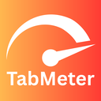
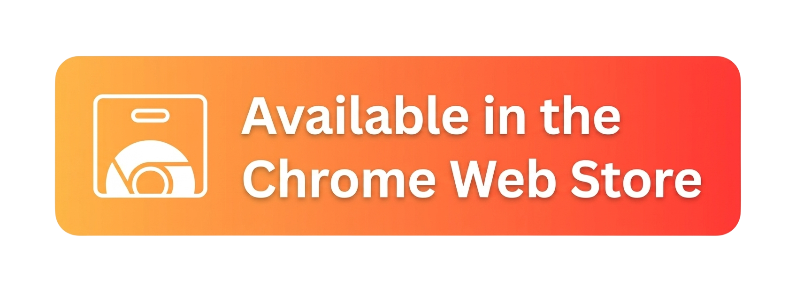
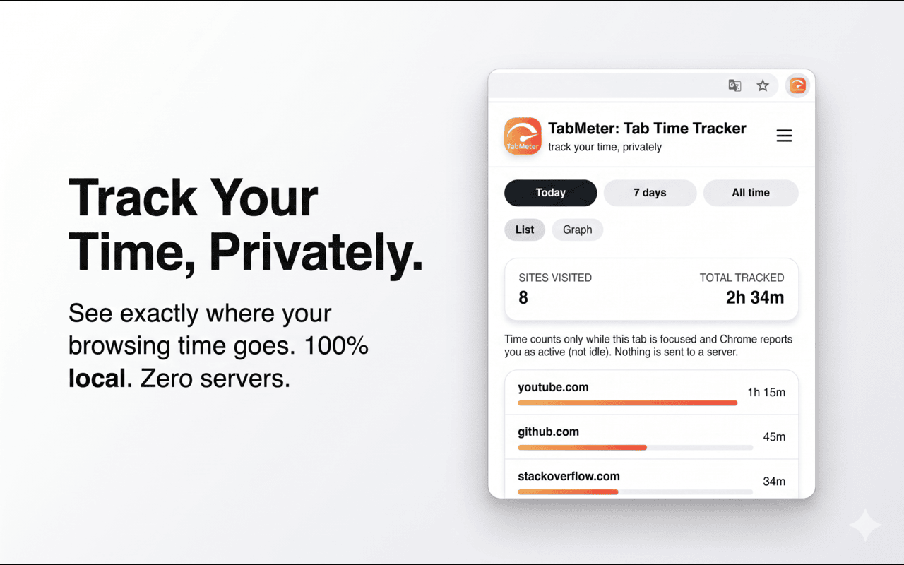
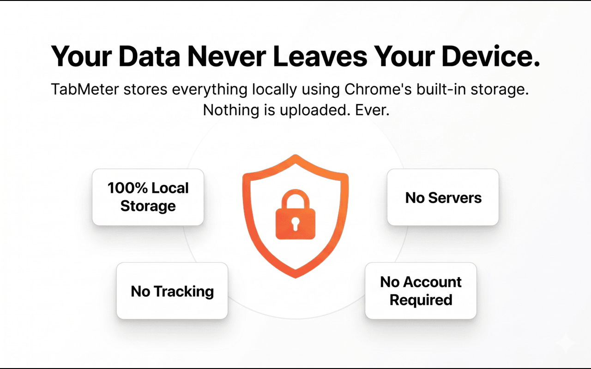
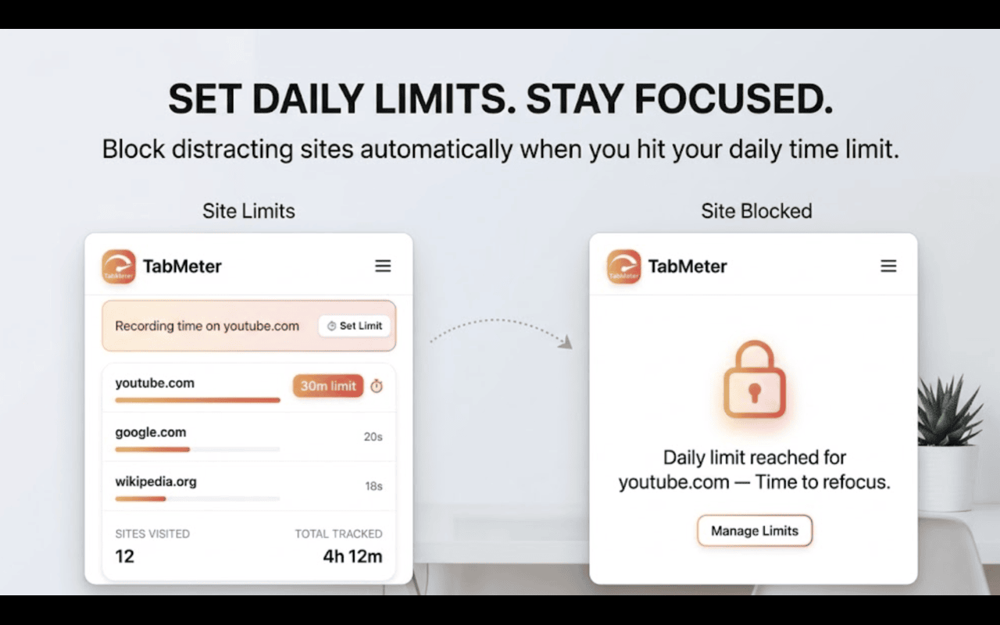

  
  <h1>TabMeter: Tab Time Tracker</h1>
  
Track your time, privately. See exactly where your browsing time goes.

  

 

TabMeter is a clean, minimal, and privacy-focused Chrome extension that automatically tracks the time you spend on different websites. No accounts, no servers, no fuss.

## Screenshots

| Dashboard | Privacy & Charts | Daily Limits |
| :---: | :---: | :---: |
|  |  |  |

## Features

- **⏱️ Automatic Tracking**: Tracks active time spent per website. Pauses automatically when you switch tabs, minimize the browser, or step away (Idle detection).
- **📊 Beautiful Analytics**: View your activity with smooth line charts for trends and stacked bar charts for weekly breakdowns.
- **🎯 Daily Limits**: Set daily time limits for distracting sites. TabMeter blocks them when your time is up.
- **🎨 Premium UI**: A clean, "MiniMax" inspired design with a white-dominant layout, rounded cards, and warm orange-red gradient accents.
- **🛠️ Side Panel Mode**: Optionally run TabMeter in your browser's side panel for continuous visibility.
- **⚙️ Fully Customizable**: Adjust your idle timeout, toggle view modes, or export your data as JSON.

## Privacy by Design

We believe your browsing habits are your own business.

- **100% Local**: All data is stored securely on your device using Chrome's local storage API.
- **No Servers**: There are no external servers, no databases, and no telemetry.
- **No Accounts**: You don't need to sign up or log in.
- **Hostnames Only**: TabMeter only records the root domain (e.g., `github.com`), never full URLs, search queries, or page content.

## Install locally (Dev Mode)

Want to poke around the code or contribute?

1. Clone or download this repository.
2. Open Chrome and navigate to `chrome://extensions`.
3. Enable **Developer mode** in the top right.
4. Click **Load unpacked** and select the `tab-time-tracking` folder.
5. Pin the extension to your toolbar.

## Repository Structure

- `manifest.json` - Chrome extension manifest (v3)
- `background.js` - Service worker for activity tracking and timing
- `popup.html` / `popup.js` / `popup.css` - Main UI and logic
- `icons/` - Extension icons

## License

[MIT License](LICENSE)